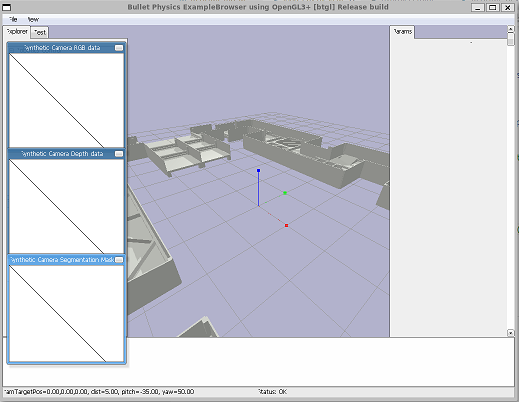

# rugged_environments
A repository to house challenging simulation environments.

Currently this repository houses maps from the ICRA 2024 Quadruped challenge [here](https://github.com/teamgrit-lab/ICRA2024_Quadruped_Robot_Challenges/tree/c7437c0af517b24c29db77dd373cd3371c98df43). These maps are provided as a ROS1 package, so this repository provides code to wrap this and make URDF files that can be used outside of ROS with paths for meshes that work.



## Pybullet

This is currently the only provided example.

```
git clone --recurse-submodules https://github.com/RPL-CS-UCL/rugged_environments
python3 -m venv my_venv
source my_venv/bin/activate
pip install pybullet==3.2.* numpy==1.26.*
python3 rugged_environments/pybullet/load_env.py
```

Or, from code to create the urdf file and resolve paths for meshes:
```
from rugged_environments.common import make_copy_urdf, FLAT_FLOOR_NAME

urdf_file_and_path = make_copy_urdf(FLAT_FLOOR_NAME)
```

## Isaac Sim

## Mujoco

## Gazebo